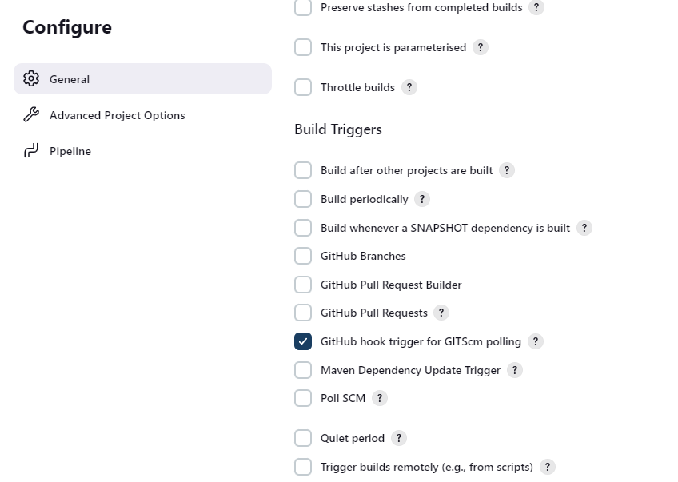
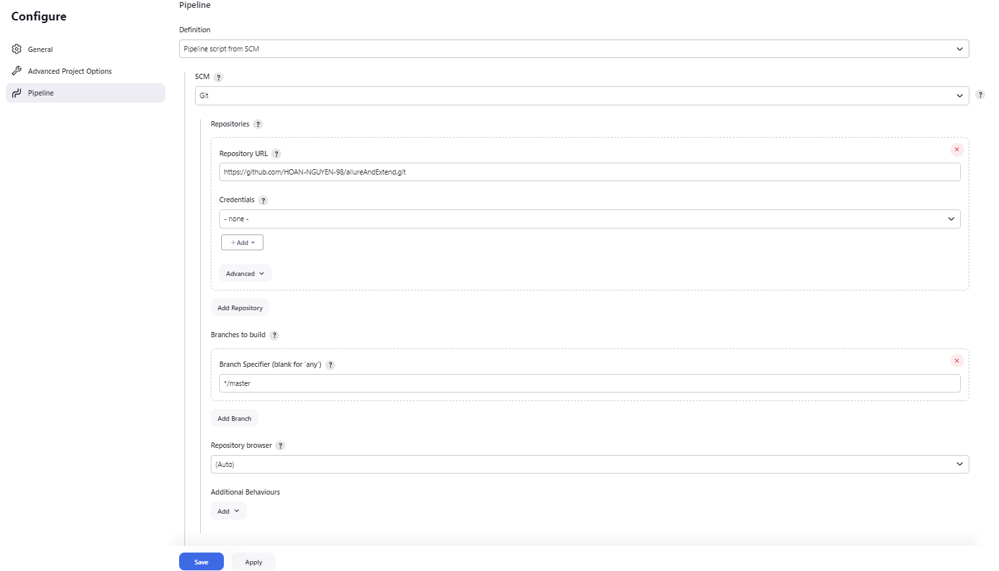

## ♻️ Selenium Maven Parallel Execution 04/2022

build: mvn compile
run: mvn test 
allure report: allure serve target/allure-results 

***🔥 Lưu ý: nhớ cập nhật thư viện trong pom.xml phiên bản mới nhất***

🔅 Có thể config 2 report là extend or allure , extend report sẽ bị security nên cần chạy lệnh bên dưới

Manage Jenkins->
Manage Nodes->
Click settings(gear icon)->
click Script console on left and type in the following command:

System.setProperty("hudson.model.DirectoryBrowserSupport.CSP", "")

## ♻️ Sử dụng webhook
Go to your repository's settings.
Select "Webhooks" and add a new webhook.
Enter your Jenkins URL followed by /github-webhook/ (e.g., http://your-jenkins-url/github-webhook/).
Set the content type to application/json.
Select the events you want to trigger the webhook (usually "Push" and "Pull request").

## ♻️ Create Jenkinsfile
Tạo 1 file có tên Jenkinsfile trong đường dẫn project
Cấu hình các thông tin
Trên Jenkins Tạo 1 item pipeline
Chọn 
Chọn tếp  và Save
Script path là Jenkinsfile